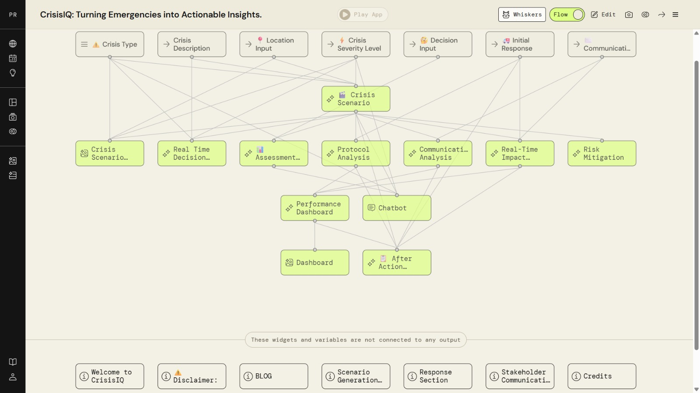
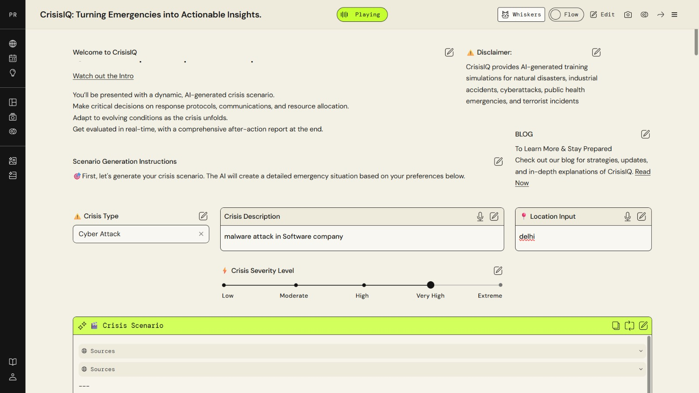
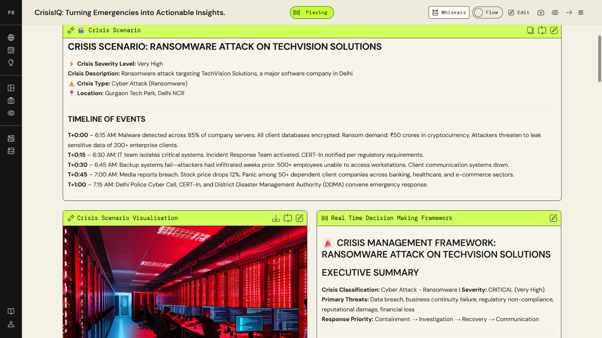
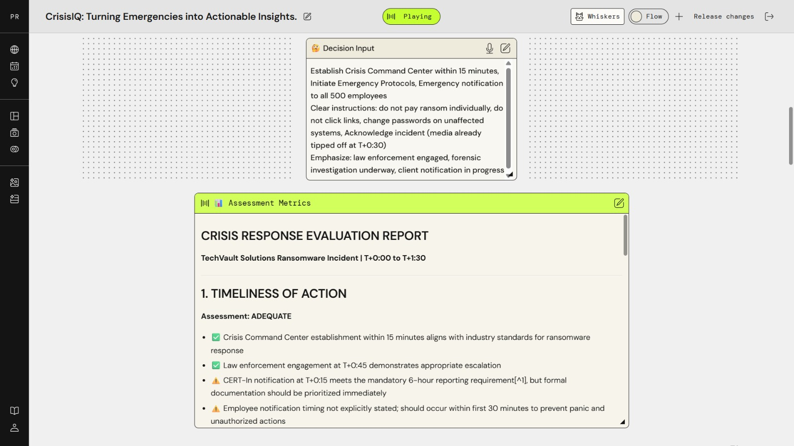
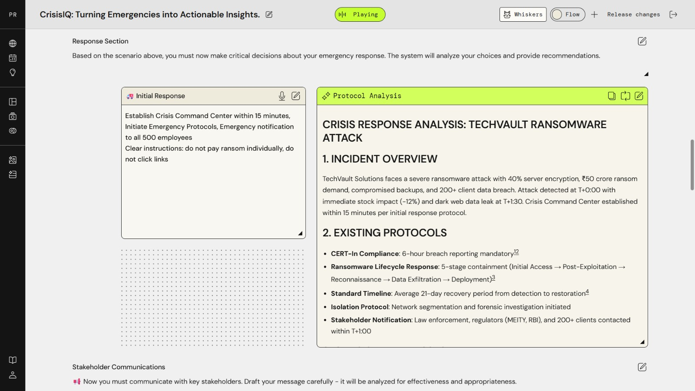
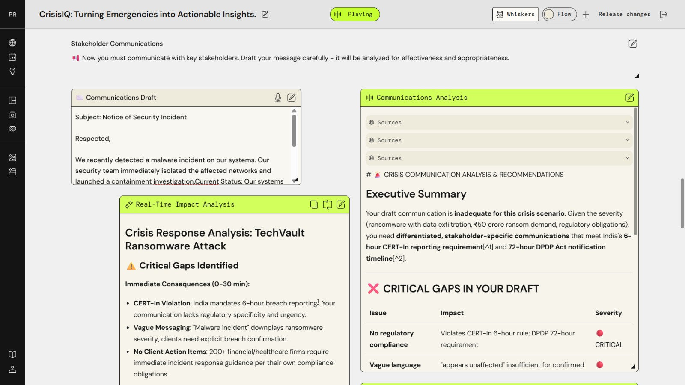
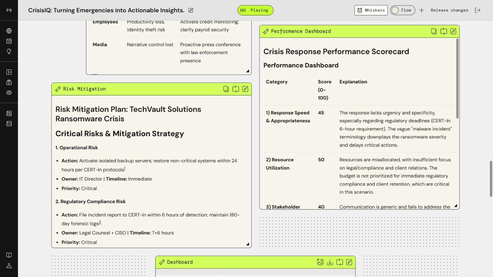
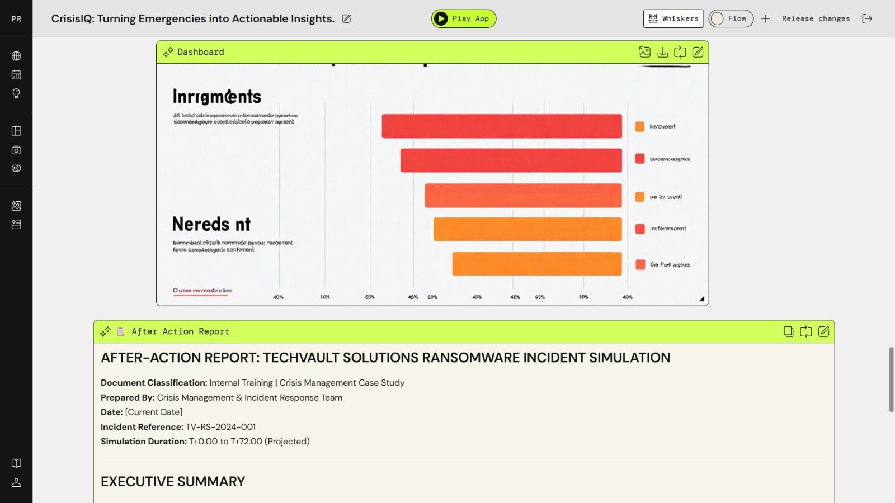
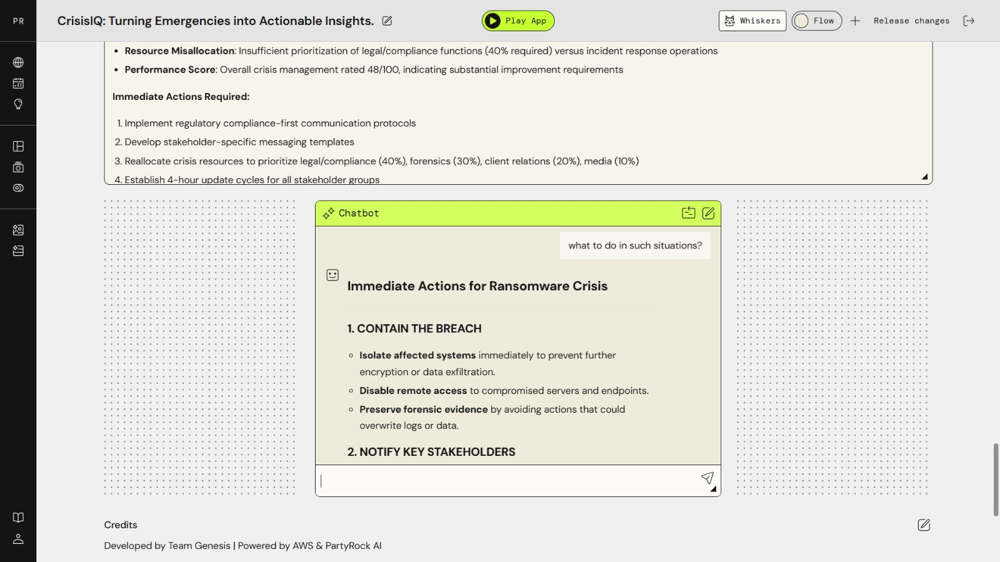

# CrisisIQ: Turning Emergencies into Actionable Insights

[](https://partyrock.aws)
[](https://partyrock.aws/u/nehaa/OU-QjlvSA/CrisisIQ%3A-Turning-Emergencies-into-Actionable-Insights)
[](https://partyrock.aws/u/nehaa/OU-QjlvSA/CrisisIQ%3A-Turning-Emergencies-into-Actionable-Insights)

> **AWS "Hack the Future with AWS" Hackathon** — AWS Skills to Jobs Tech Alliance India  
> **Achievement:** Ranked Top 20 of 50+ participating teams | October 2025  
> **Team:** Team Genesis (4 members)

---

## 🔗 Live Application

**[▶ Try CrisisIQ on AWS PartyRock](https://partyrock.aws/u/nehaa/OU-QjlvSA/CrisisIQ%3A-Turning-Emergencies-into-Actionable-Insights)**

---

## What is CrisisIQ?

CrisisIQ is a full-pipeline AI-powered crisis training simulator built on AWS PartyRock and Amazon Bedrock foundation models.

It puts users in the role of a crisis response decision-maker — presenting them with a dynamically generated emergency scenario, then evaluating their decisions across response protocols, stakeholder communications, regulatory compliance, and resource allocation.

The app covers five crisis categories:
- 🌊 Natural Disasters
- 🏭 Industrial Accidents  
- 💻 Cyberattacks (Ransomware, Malware, DDoS)
- 🏥 Public Health Emergencies
- ⚠️ Terrorist Incidents

---

## Application Architecture

CrisisIQ uses a **14-widget connected pipeline** built entirely on AWS PartyRock:

```
INPUTS
├── Crisis Type (dropdown)
├── Crisis Description (text)
├── Location Input (text)
├── Crisis Severity Level (slider: Low → Extreme)
├── Decision Input (user response)
├── Initial Response (user communication draft)
└── Communications Draft (stakeholder message)
        │
        ▼
PROCESSING (Amazon Bedrock Foundation Models)
├── Crisis Scenario Generator
│   └── Full scenario narrative + timeline of events
├── Crisis Scenario Visualisation (AI image)
├── Real-Time Decision Making Framework
├── Assessment Metrics (scored evaluation)
├── Protocol Analysis
├── Communications Analysis (regulatory gap check)
├── Real-Time Impact Analysis
└── Risk Mitigation Plan
        │
        ▼
OUTPUTS
├── Performance Dashboard (scorecard)
├── Dashboard (visual summary)
├── After Action Report (full debrief)
└── Chatbot (follow-up Q&A)
```

---

## Key Features

### 🎯 Dynamic Scenario Generation
Generates a complete crisis scenario including full timeline of events (T+0:00 onwards), affected systems, casualty estimates, and escalation triggers — unique every run.

### ⚡ Real-Time Decision Evaluation
Users input their response decisions. The system evaluates them against industry frameworks and provides immediate scored feedback with specific improvement recommendations.

### 📡 Communications Analysis
Analyses user-drafted stakeholder communications for:
- Regulatory compliance (India CERT-In 6-hour breach reporting requirement)
- DPDP Act 72-hour notification compliance
- Message clarity, specificity, and stakeholder-appropriateness
- Identifies critical gaps with severity ratings

### 📊 Performance Scorecard
Scores user performance across multiple dimensions (0–100):
- Response Speed & Appropriateness
- Resource Utilization
- Stakeholder Communication
- Regulatory Compliance

### 🛡️ Risk Mitigation Planning
Generates a structured risk mitigation plan with:
- Risk category, action steps, responsible owner, and timeline
- Priority levels (Critical / High / Medium)

### 📋 After-Action Report
Produces a full post-simulation debrief document including executive summary, performance analysis, lessons learned, and immediate corrective actions.

### 🤖 Integrated Chatbot
Real-time AI chatbot for follow-up questions, deeper explanations of protocols, and scenario clarification throughout the simulation.

---

## Screenshots

### App Architecture (Flow View)


### App Interface — Scenario Setup


### Generated Crisis Scenario + Timeline


### Decision Input & Assessment Metrics


### Protocol Analysis


### Communications Draft & Analysis


### Risk Mitigation & Performance Dashboard


### Dashboard & After-Action Report


### Chatbot


---

## Technology Stack

| Layer | Technology |
|-------|-----------|
| Platform | AWS PartyRock |
| AI Engine | Amazon Bedrock Foundation Models |
| Image Generation | Amazon Bedrock (image widget) |
| Conversational AI | Amazon Bedrock Chatbot widget |
| Prompt Engineering | Custom multi-stage prompt pipeline |
| Hosting | AWS (partyrock.aws domain) |

---

## Problem Statement

Emergency responders, government officials, and organisations often lack access to realistic, low-cost crisis training simulations. Traditional tabletop exercises are expensive, infrequent, and difficult to customise. CrisisIQ makes dynamic, AI-generated crisis training accessible to anyone — enabling practice of critical decisions in a safe, evaluated environment.

---

## Hackathon Details

| Detail | Info |
|--------|------|
| Event | AWS "Hack the Future with AWS" Hackathon |
| Organiser | AWS Skills to Jobs Tech Alliance India & AWS Education Programs |
| Date | October 9, 2025 |
| Result | **Top 20 of 50+ teams** |
| Team | Team Genesis (4 members) |
| Institution | Konkan Gyanpeeth College of Engineering, Karjat |

---

## Team Genesis

Built by a team of 4 CSE students from Konkan Gyanpeeth College of Engineering during the AWS hackathon.

---

*Powered by AWS & PartyRock AI*
